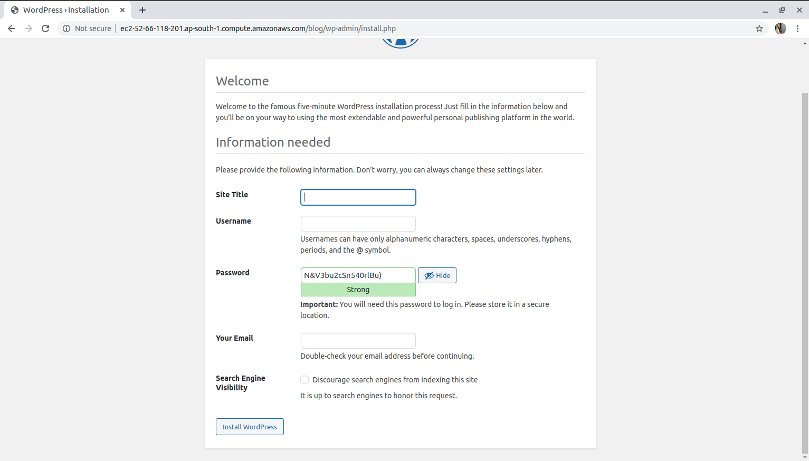

# WORDPRESS DEPLOYMENT ON AWS EC2 
## First launch an ec2 instance
  for learning in detail how to launch ec2 instance 
  
## After launching an ec2 ,install apache-httpd and start it's service
```
root@jarvis:~# yum install httpd -y
root@jarvis:~# systemctl enable --now httpd
```
##  install mysql or mariadb for database and start it's service

```
root@jarvis:~#  yum install mariadb-server
root@jarvis:~# systemctl start mariadb
```
### After starting it's service ,log in to mariadb 
```
root@jarvis:~# mysql_secure_installation 
NOTE: RUNNING ALL PARTS OF THIS SCRIPT IS RECOMMENDED FOR ALL MariaDB
      SERVERS IN PRODUCTION USE!  PLEASE READ EACH STEP CAREFULLY!

In order to log into MariaDB to secure it, we'll need the current
password for the root user.  If you've just installed MariaDB, and
you haven't set the root password yet, the password will be blank,
so you should just press enter here.

Enter current password for root (enter for none): 
OK, successfully used password, moving on...

Setting the root password ensures that nobody can log into the MariaDB
root user without the proper authorisation.

Set root password? [Y/n] y
New password: 
Re-enter new password: 
Password updated successfully!
Reloading privilege tables..
 ... Success!


By default, a MariaDB installation has an anonymous user, allowing anyone
to log into MariaDB without having to have a user account created for
them.  This is intended only for testing, and to make the installation
go a bit smoother.  You should remove them before moving into a
production environment.

Remove anonymous users? [Y/n] y
 ... Success!

Normally, root should only be allowed to connect from 'localhost'.  This
ensures that someone cannot guess at the root password from the network.

Disallow root login remotely? [Y/n] y
 ... Success!

By default, MariaDB comes with a database named 'test' that anyone can
access.  This is also intended only for testing, and should be removed
before moving into a production environment.

Remove test database and access to it? [Y/n] y
 - Dropping test database...
 ... Success!
 - Removing privileges on test database...
 ... Success!

Reloading the privilege tables will ensure that all changes made so far
will take effect immediately.

Reload privilege tables now? [Y/n] y
 ... Success!

Cleaning up...

All done!  If you've completed all of the above steps, your MariaDB
installation should now be secure.

Thanks for using MariaDB!


```

## Now install php but for installing latest version of php first install epel and then install php 7.2
```
root@jarvis:~# amazon-linux-extras install epel
root@jarvis:~# amazon-linux-extras install php7.2
```

## To download and unzip wordpress package

### First go to /var/www/html/ and download wordpress package over there 

```
root@jarvis:~# wget https://wordpress.org/latest.tar.gz
```

### and for unzipping the given package
```
root@jarvis:~# tar -xzvf latest.tar.gz
```
### Now move wordpress directory to another directory

```
root@jarvis:~# mv wordpress blog
```
### Move to that direcory and take a backup of wp-config-sample.php
```
root@jarvis:~# cp wordpress/wp-config-sample.php wordpress/wp-config.php

```

## To create a database for wordpress installation

First we need to logged in to database 
```
root@jarvis:~#  mysql -u root -p 
```
After logging in to mysql , now create a user and password for database
```
CREATE USER 'wordpress-user'@'localhost' IDENTIFIED BY 'your_strong_password';
```
Create a database 
```
CREATE DATABASE `wordpress-db`;
```
Now grant full privileges to your database
```
GRANT ALL PRIVILEGES ON `wordpress-db`.* TO "wordpress-user"@"localhost";
```
Flush the database privileges to pick up all of your changes
```
FLUSH PRIVILEGES;
```
Exit the mysql client
```
exit
```

### Edit wp-config.php
```
vim wordpress/wp-config.php
define('DB_NAME', 'wordpress-db');
define('DB_USER', 'wordpress-user');
define('DB_PASSWORD', 'your_strong_password');
```

### Now restart your httpd service
```
root@jarvis:~# systemctl restart httpd
```
## Now put your DNS into your browser and run wordpress !!!
```
ec2-13-235-50-157.ap-south-1.compute.amazonaws.com/blog
```



### If you see this window then bingo your wordpress is successfully deployed on ec2 instance !!!!
